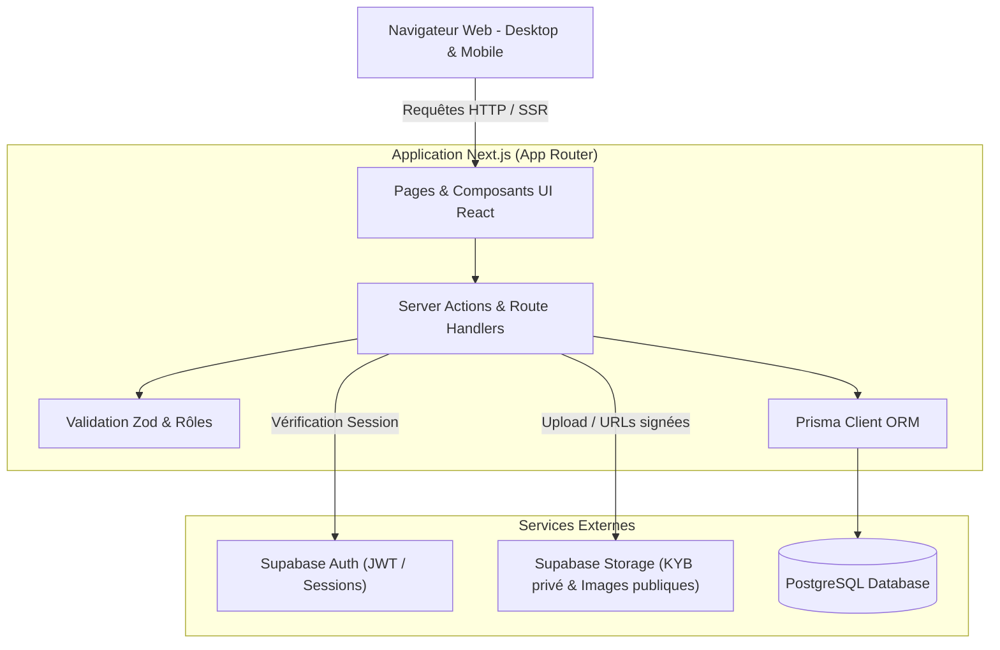

# Spécification de Conception : Plateforme B2B Lougara (MVP)

**Date :** 2026-09-11  
**Statut :** Proposé pour validation  
**Auteur :** Antigravity & Équipe Lougara  
**Référence stratégique :** `Doc/Analyse_et_recommandations_Lougara.md`  

---

## 1. Vision et Objectifs du MVP

Lougara est une plateforme B2B de sourcing et de mise en relation de confiance entre des entrepreneurs et des fournisseurs/grossistes d'Afrique et d'Europe.

### 1.1 Problème résolu
- Difficulté pour les entrepreneurs européens et africains de trouver des fournisseurs fiables, réactifs et légalement constitués.
- Absence de transparence sur la qualité, la légalité et les conditions B2B (MOQ, délais, conformité).
- Risque d'arnaques et d'opacité dans les transactions transfrontalières.

### 1.2 Facteur différenciant (Le Pilier Confiance)
- Système de vérification rigoureux (KYB/KYC) attribuant le statut **« Fournisseur Vérifié Lougara »** après contrôle administratif manuel des documents d'immatriculation (RCCM/Kbis, identité du dirigeant, justificatif de domiciliation).

### 1.3 Périmètre MVP (Principe YAGNI)
- **Inclus dans le MVP :**
  1. Authentification et gestion de profils (Fournisseur, Entrepreneur/Acheteur, Administrateur).
  2. Dépôt de dossier et modération administrative du statut « Vérifié ».
  3. Gestion de catalogue B2B (fiches produits avec MOQ, devis indicatif, pays d'origine, incoterms, photos).
  4. Moteur de recherche multicritère (secteur, pays, statut vérifié, MOQ).
  5. Module de mise en relation et messagerie B2B (demande de devis structurée + fil de discussion sécurisé).
- **Exclus temporairement du MVP (phases ultérieures) :**
  - Passerelle de paiement escrow / transactions bancaires intégrées.
  - Régie publicitaire et mise en avant payante automatisée.
  - Outils logistiques automatisés et tracking de fret.

---

## 2. Architecture Technique Globale

### 2.1 Stack Technologique Retenue
- **Frontend & Backend Applicatif :** Next.js 15+ (App Router, Server Actions, React Server Components, TypeScript).
- **Styling UI :** Tailwind CSS + Lucide Icons + Radix UI / Shadcn UI pour des composants accessibles et professionnels.
- **ORM & Base de données relationnelle :** PostgreSQL avec Prisma ORM pour le modèle métier, les relations et la modélisation stricte des types.
- **Authentification & Stockage Fichiers (BaaS) :** Supabase :
  - *Supabase Auth* pour la gestion des sessions sécurisées (email/mot de passe, magic link, confirmation par e-mail).
  - *Supabase Storage* pour l'hébergement sécurisé :
    - Bucket `product-assets` (public en lecture).
    - Bucket `kyb-documents` (strictement privé, accès restreint aux admins et propriétaires via URLs signées temporaires).
- **Validation des données :** Zod pour la validation runtime des formulaires et des Server Actions.
- **Tests :** Vitest pour les tests unitaires et d'intégration des services métier, Playwright pour les flux critiques.

### 2.2 Diagramme d'Architecture



---

## 3. Modèle de Données (Schéma Relationnel Prisma)

```prisma
datasource db {
  provider = "postgresql"
  url      = env("DATABASE_URL")
}

generator client {
  provider = "prisma-client-js"
}

enum UserRole {
  BUYER
  SUPPLIER
  ADMIN
}

enum VerificationStatus {
  NOT_SUBMITTED
  PENDING
  VERIFIED
  REJECTED
}

enum DocumentType {
  COMMERCIAL_REGISTER // Kbis / RCCM
  TAX_ID_CERTIFICATE  // NINEA / NIF
  IDENTITY_DOCUMENT   // Passeport / CNI Gérant
  UTILITY_BILL        // Justificatif de domicile pro
}

model User {
  id             String          @id @default(cuid())
  supabaseUid    String          @unique
  email          String          @unique
  role           UserRole        @default(BUYER)
  firstName      String?
  lastName       String?
  avatarUrl      String?
  company        CompanyProfile?
  sentMessages   Message[]       @relation("SentMessages")
  conversations  Conversation[]  @relation("BuyerConversations")
  createdAt      DateTime        @default(now())
  updatedAt      DateTime        @updatedAt
}

model CompanyProfile {
  id                 String               @id @default(cuid())
  userId             String               @unique
  user               User                 @relation(fields: [userId], references: [id], onDelete: Cascade)
  companyName        String
  country            String
  city               String
  registrationNumber String?
  sector             String               // Ex: Cosmétique, Textile, Agroalimentaire
  description        String?
  website            String?
  phone              String?
  logoUrl            String?
  verificationStatus VerificationStatus   @default(NOT_SUBMITTED)
  verificationNotes  String?
  verifiedAt         DateTime?
  documents          VerificationDocument[]
  products           Product[]
  receivedConvs      Conversation[]       @relation("SupplierConversations")
  createdAt          DateTime             @default(now())
  updatedAt          DateTime             @updatedAt
}

model VerificationDocument {
  id           String       @id @default(cuid())
  companyId    String
  company      CompanyProfile @relation(fields: [companyId], references: [id], onDelete: Cascade)
  documentType DocumentType
  filePath     String       // Chemin dans le bucket Supabase sécurisé
  fileName     String
  fileSize     Int
  mimeType     String
  uploadedAt   DateTime     @default(now())
}

model Product {
  id            String         @id @default(cuid())
  companyId     String
  company       CompanyProfile @relation(fields: [companyId], references: [id], onDelete: Cascade)
  title         String
  slug          String         @unique
  description   String
  category      String
  priceMin      Decimal?
  priceMax      Decimal?
  currency      String         @default("EUR") // EUR, XOF, etc.
  moq           Int            @default(1)     // Minimum Order Quantity
  unit          String         @default("pièce")
  originCountry String
  images        String[]       // URLs publiques
  isPublished   Boolean        @default(true)
  conversations Conversation[]
  createdAt     DateTime       @default(now())
  updatedAt     DateTime       @updatedAt
}

model Conversation {
  id         String         @id @default(cuid())
  buyerId    String
  buyer      User           @relation("BuyerConversations", fields: [buyerId], references: [id])
  supplierId String
  supplier   CompanyProfile @relation("SupplierConversations", fields: [supplierId], references: [id])
  productId  String?
  product    Product?       @relation(fields: [productId], references: [id], onDelete: SetNull)
  subject    String
  createdAt  DateTime       @default(now())
  updatedAt  DateTime       @updatedAt
  messages   Message[]
}

model Message {
  id             String       @id @default(cuid())
  conversationId String
  conversation   Conversation @relation(fields: [conversationId], references: [id], onDelete: Cascade)
  senderId       String
  sender         User         @relation("SentMessages", fields: [senderId], references: [id])
  content        String
  isRead         Boolean      @default(false)
  createdAt      DateTime     @default(now())
}
```

---

## 4. Parcours Utilisateurs et Spécifications des Écrans

### 4.1 Onboarding & Vérification Fournisseur (KYB)
1. **Inscription :** Choix du rôle `Fournisseur`. Saisie de l'e-mail et mot de passe via Supabase Auth.
2. **Profil Entreprise :** Saisie de la raison sociale, numéro légal (SIRET, RCCM), pays, secteur (sélection cosmétique, textile, agroalimentaire, etc.).
3. **Dépôt des Pièces Légales :** Téléversement des documents requis dans le bucket privé. Statut passe à `PENDING`.
4. **Validation Administrative :** 
   - L'administrateur visualise les pièces dans son tableau de bord sécurisé.
   - Bouton "Valider" (statut -> `VERIFIED`, date enregistrée, badge activé) ou "Refuser" (motif explicatif enregistré).

### 4.2 Publication et Gestion du Catalogue (Fournisseur)
1. Ajout de produit avec : Titre, Catégorie, Description, MOQ (Quantité minimale de commande), Fourchette de prix indicatif, Pays d'origine, Photos multiples.
2. Gestion de l'état publié/masqué.

### 4.3 Découverte et Recherche B2B (Entrepreneur / Acheteur)
1. **Page d'accueil & Catalogue :**
   - Barre de recherche textuelle avec autocomplétion.
   - Filtres à facettes : Pays fournisseur/origine, Secteur, Statut « Vérifié Lougara » uniquement, MOQ max.
   - Carte produit avec badge vert distinctif **« Fournisseur Vérifié Lougara »**.
2. **Fiche Produit et Fiche Entreprise :**
   - Caractéristiques techniques, historique et coordonnées vérifiées de l'entreprise.
   - Bouton d'action principal : **« Demander un devis / Échanger »**.

### 4.4 Demande de Devis & Messagerie B2B
1. Modale de contact pré-remplie : volume estimé désiré, pays de livraison, message d'introduction.
2. Création d'une `Conversation` rattachée au produit et notification fournisseur.
3. Boîte de réception B2B pour échanger, clarifier les spécifications et convenir d'échantillons ou d'expéditions.

---

## 5. Sécurité, Rôles et Gestion des Erreurs

### 5.1 Sécurité & Confidentialité
- **Protection des documents KYB :** Les documents légaux d'immatriculation contiennent des données sensibles. Ils ne doivent **JAMAIS** être exposés via des URLs publiques statiques. Seuls les admins et le fournisseur titulaire peuvent générer des URLs présignées temporaires (expiration 5 minutes).
- **Contrôle d'accès basé sur les rôles (RBAC) :**
  - Seul un utilisateur avec le rôle `ADMIN` peut modifier le champ `verificationStatus` d'une entreprise.
  - Seul un utilisateur avec le rôle `SUPPLIER` peut créer et publier des produits.
  - Les Server Actions vérifient systématiquement la correspondance entre la session active et le `userId`.

### 5.2 Gestion des Erreurs
- Validation systématique côté serveur via Zod avec retour d'erreurs champ par champ pour les formulaires.
- Écrans d'erreur standardisés Next.js (`error.tsx`, `not-found.tsx`).
- Journalisation des échecs d'authentification et des tentatives d'accès non autorisées.

---

## 6. Stratégie de Test et Critères d'Acceptation

### 6.1 Tests Unitaires & d'Intégration
- Tests des schémas de validation Zod (création produit, profil entreprise, validation KYB).
- Tests des services Prisma d'interrogation du catalogue avec filtres combinés (ex: pays + statut vérifié).
- Tests d'isolation de la messagerie (un tiers ne peut pas lire une conversation entre l'acheteur A et le fournisseur B).

### 6.2 Tests End-to-End (Playwright)
- Parcours complet 1 : Inscription Fournisseur -> Remplissage profil -> Dépôt document KYB -> Validation admin -> Activation du badge.
- Parcours complet 2 : Création produit par le fournisseur -> Recherche par l'acheteur -> Envoi d'une demande de devis -> Réception dans la messagerie du fournisseur.
